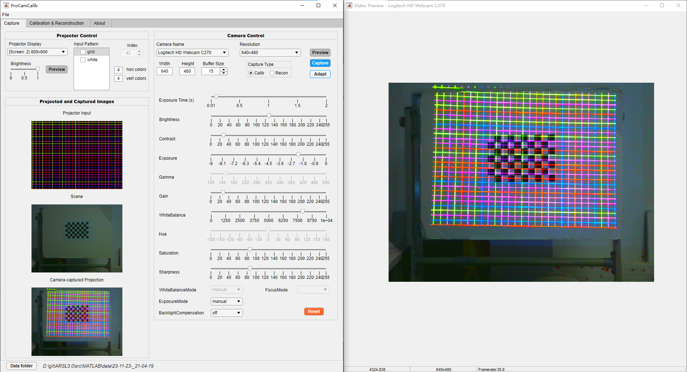

Adaptive Color Structured Light for Calibration and Shape Reconstruction
===

## Introduction
We propose an approach that can efficiently adapt color SL to arbitrary ambient light and imaging devices’ color responses, without device response function calibration or geometric calibration. First, we design a novel algorithm to quickly find the most distinct colors that are easily separable under a new environment and device setup. Then, we design a maximum a posteriori (MAP)-based color detection algorithm that can utilize ambient light and device priors to robustly detect the SL colors.

For more info please refer to our [paper][5] and [supplementary][6].

## Usage

#### Build from source
1. Install MATLAB 2021a.
2. Install [mexOpenCV v3.4.1][2]

#### Reproduce paper results
1. Download dataset by [Google Drive][3] or [Baidu Netdisk][4] (code: ptdh), and extract to [`data/`](data).
2. Set `dataName` in `compareCalibAndRecon.m` to `Setting1 ~ Setting7` and `Light1 ~ Light6`  and run `compareCalibAndRecon.m` in sequence to reproduce paper results. An example is shown below, we reproduce results in Setting1. `dataName = 'Setting1'`
3. Set `dataName` in `compareSingleShotRecon.m` to `singleShotRecon_settingA` and `singleShotRecon_settingB` and run `compareSingleShotRecon.m` for different objects (set `reconName` to `David`, `Fan` and `Box`) in sequence to reproduce paper results. An example is shown below, we reproduce results in SettingA. `dataName = 'singleShotRecon_settingA'` and `reconName = 'David'`

#### App tutorial
1. Run `calibApp.mlapp` to start the App.
2. Adaptive color pattern generation: First, let the calibration board face the camera as much as possible, then keep it still, and click the `Adapt` button as show in the below figure. It should be noted that if imaging setting and ambient light condition change, please repeat the above operation. 
3. In addition, we have also add the function to independently set the number of horizontal and vertical colors to allow users to adjust the density of the color grid according to their needs, which are `hori colors` and `vert colors`.

4. For more detailed tutorials, please refer to [single-shot-pro-cam-calib][1].
 
## Folder Structure
The project folder is organized as follows:

    ├─+AdaptiveGenPattern                           generate adaptive color pattern package directory
    ├─+Calibration                                  calibration package directory
    ├─+GUI                                          GUI package directory
    ├─+ImgProc                                      image processing package directory
    ├─+Reconstruct                                  3d reconstruction package directory
    ├─+Utils                                        utilities package directory
    ├─data                                          directory for data
    │  ├─calibAndReconExp                           directory for experiments of calibration and reconstruction under different imaging settings and ambient conditions, which includes Setting1~Setting7, and Light1~Light6
    │  ├─ipadProRecon                               directory for point cloud reconstructed using ipad pro, which includes David, girl, box and fan.
    │  ├─singeShotReconExp                          directory for experiments of single-shot reconstruction in different imaging settings
    ├─doc                                           directory for documentation
    └─README.md                                     this file
    
## Citation
Please cite the paper in your publications if it helps your research:

    @inproceedings{dong2023adaptive,
        title={Adaptive Color Structured Light for Calibration and Shape Reconstruction},
        author={Dong, Xin, Ling, Haibin, and Huang, Bingyao},
        booktitle={2023 IEEE International Symposium on Mixed and Augmented Reality (ISMAR) (accepted)},
        pages={},
        year={2023},
        organization={IEEE}
    }

## Acknowledgments 
- This software and code borrows heavily from [single-shot-pro-cam-calib][1].
- We express our gratitude to the anonymous reviewers for their valuable and insightful comments and suggestions, which have been truly inspiring.
- Please don't hesitate to create an issue if you have any questions, suggestions, or concerns.

## License
This software is freely available for non-profit non-commercial use, and may be redistributed under the conditions in [license](LICENSE).

[1]: https://github.com/BingyaoHuang/single-shot-pro-cam-calib
[2]: https://github.com/kyamagu/mexopencv
[3]: https://drive.google.com/file/d/140r1M2IeAO_4PAyDfsJUoMpORTa6n7k_/view?usp=drive_link
[4]: https://pan.baidu.com/s/1OPqNqDDDLvb_pxmst7M_qg
[5]: https://bingyaohuang.github.io/pub/Adaptive_color_SL
[6]: https://bingyaohuang.github.io/pub/Adaptive_color_SL/supp
